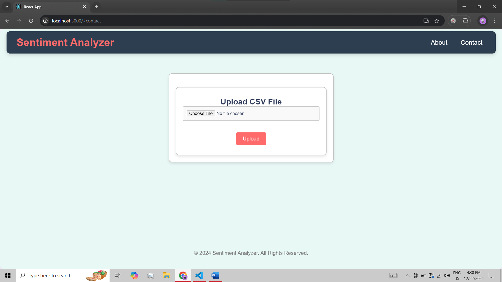

# SentimentScope: AI Sentiment Analysis API 🚀

## Features 🌟

- **AI-Powered Sentiment Analysis** 🤖💬: Utilizes **Gemini 1.5 Pro** for accurate sentiment analysis, classifying text as **positive**, **negative**, or **neutral**.
- **CSV File Upload** 📂🔼: Upload CSV files containing `id`, `text`, and optional `timestamp` for bulk sentiment analysis.
- **Data Visualization** 📊🎨: Display sentiment distribution with **bar charts** and **pie charts** for easy insights.
- **Secure Authentication** 🔐💼: Ensures secure API access using token-based authentication.
- **Cloud Deployment** 🌐☁️: Deployed on **AWS** for both backend and frontend hosting.
- **Interactive React Portal** 🖥️🎯: A user-friendly React interface for uploading files and viewing analysis results in real-time.

## Technology Stack 🧰

- **Backend**: FastAPI
- **Frontend**: React
- **AI**: **Gemini 1.5 Pro** for sentiment analysis
- **Cloud**: Deployed on **AWS** for both backend and frontend

## Screenshots 📸

Here are some screenshots of the **SentimentScope** application in action:

  
*CSV File Upload Page*

## Deployment 🚀

- **Backend**: Hosted on **AWS** using FastAPI
- **Frontend**: Hosted on **AWS** with React

## License 📜

MIT License
